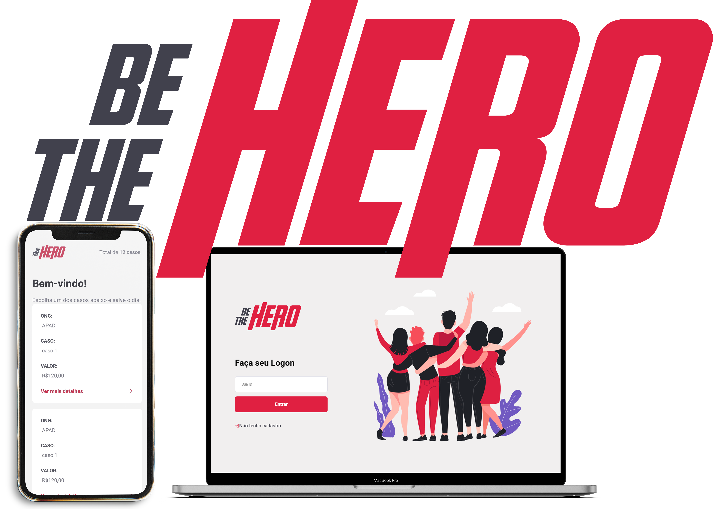

<h1 align="center">
    
</h1>

  
  
  
  
   
  

  
  
  
  
  

  <a href="#computer-linguagens">Linguagens</a>&nbsp;&nbsp;&nbsp;|&nbsp;&nbsp;&nbsp;
  <a href="#rocket-tecnologias">Tecnologias</a>&nbsp;&nbsp;&nbsp;|&nbsp;&nbsp;&nbsp;
  <a href="#memo-licença">Licença</a>

### :wrench: Projeto

<b>Be the Hero</b> é um projeto que tem como escopo ajudar, de maneira <b>financeira</b>, uma instituição de caridade,
atraves da divulgação de suas causas para que as pessoas possam ver e colaborar com as instituições.

### :star: Qual a importância de ajudar uma ONG?   
Ao realizar uma doação, sentimos que estamos contribuindo para melhorar a vida do outro,
e por vezes o que é tão pouco para nós, pode fazer uma enorme diferença ao proximo,
sem contar que não a nada melhor do que saber que o sorriso do outro e por sua causa,
que a felicidade de alguem, mesmo que momentanea, foi proporcionada por você

### Experiencia da Semana Omnistack
Foi a primeira vez em que programei algo de fato, do início ao fim, e para não dizer que não tinha experiencia,
tive meu primeiro contato com JavaScript e Ecma6+ no curso Starter da RocketSeat, realmente foi de grande ajuda.

Apesar de nunca ter programado algo, aceitei a Semana Omnistack como um desafio, pois diziam que era pra pessoas do ramo e experientes, embora pareça que somente “copiamos” o código, eu aprendi muito, mas eu acho que isso vai muito do estudante de não se contentar 
com pouco, de buscar saber sempre mais do que lhe é passado, essa semana foi como aprender a prática e a teoria de tabela, junto com conceitos, resolução de problemas, aprender a ler documentação, buscar por informação e além de tudo aprendi como é estar em uma comunidade unida, porque mesmo que tenha solucionado a maioria dos problemas sozinho por querer aprender como se em uma prova estivesse :satisfied:, quando precisei da comunidade ela estava la pra ajudar, assim como também ajudei muitos e poder fazer parte de tudo isso foi realmente muito massa é uma experiência que levo pra vida, muito obrigado RocketSeat

### :recycle: Como contribuir

- Fork esse repositório;
- Crie uma branch com a sua feature: `git checkout -b my-feature`
- Commit suas mudanças: `git commit -m 'feat: My new feature'`
- Push a sua branch: `git push origin my-feature`

## :computer: Linguagens

- **Javascript**
- **NodeJS**
- **HTML**
- **CSS**
- **SQL**

## :rocket: Tecnologias
- ### Backend 
	* **celebrate**:  ^12.0.1
	* **cors**:  ^2.8.5
	* **cross-env**:  ^7.0.2
	* **dotenv**:  ^8.2.0
	* **express**:  ^4.17.1
	* **knex**:  ^0.20.13
	* **nodemailer**:  ^6.4.6
	* **nodemailer-express-handlebars**:  ^4.0.0
	* **nodemon**: ^2.0.2 
	* **sqlite3**:  ^4.1.1

- ### Web
	* **@testing-library/jest-dom**:  ^4.2.4
	* **@testing-library/react**:  ^9.3.2
	* **@testing-library/user-event**:  ^7.1.2
	* **axios**:  ^0.19.2
	* **polished**:  ^3.5.1
	* **react**:  ^16.13.1
	* **react-dom**:  ^16.13.1
	* **react-icons**:  ^3.9.0
	* **react-router-dom**:  ^5.1.2
	* **react-scripts**:  3.4.1",
	* **react-toastify**:  ^5.5.0
	* **styled-components**:  ^5.0.1

- ### Mobile
	- #### React navigation
		* **@react-native-community/masked-view**: 0.1.5
		* **@react-navigation/drawer**:  ^5.3.4
		* **@react-navigation/native**:  ^5.1.3
		* **@react-navigation/stack**:  ^5.2.6
	* **axio**s:  ^0.19.2
	* **expo**:  ~36.0.0
	* **expo-constants**:  ~8.0.0
	* **expo-mail-composer**:  ~8.0.0
	* **intl**:  ^1.2.5
	- #### React
		* **react**:  ~16.9.0
		* **react-dom**:  ~16.9.0
		* **react-native**:  https://github.com/expo/react-native/archive/sdk-36.0.0.tar.gz
		* **react-native-gesture-handler**:  ~1.5.0
		* **react-native-reanimated**:  ~1.4.0
		* **react-native-safe-area-contex**:  0.6.0
		* **react-native-screens**:  2.0.0-alpha.12
		* **react-native-web**:  ~0.11.7
	* **styled-components**:  ^5.0.1
	
	
## :memo: Licença

Este projeto está no MIT. Veja aqui [LICENSE] (/ LICENSE) para mais informações.

---

by <strong>Luis Cazuriaga:wave: 

